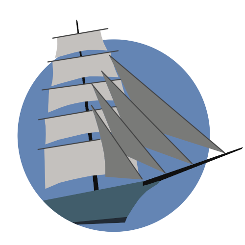

# mast

Tools for discovering and recommendating new accounts to follow on Mastodon



## Example Workflow

### Setup

```
python3 -m virtualenv v/
source v/bin/activate
pip install -r requirements.txt
```

### Source a batch of samples

```
python3 downloader.py
```

### Explore options by pseudo-random sampling and rating content

```
python3 explore.py
```

### Explore options by exploring content "near" to liked content

```
python3 bandity.py
```

### View the results

```
python3 report.py
```
