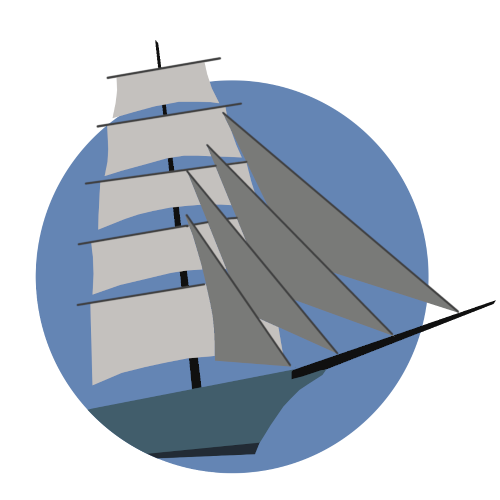

# mast

Tools for discovering and recommendating new accounts to follow on Mastodon



## Example Workflow

### Setup

```
git clone https://github.com/buckbaskin/mast.git
cd mast/
```

```
python3 -m virtualenv v/
source v/bin/activate
pip install -r requirements.txt
```

### Source a batch of samples

```
python3 mast.py download -t 1000
```

### Explore options by pseudo-random sampling and rating content

```
python3 mast.py bandit --explore -t 20
```

Note: The `-t` option indicates the number of toots to explore

### Explore options by exploring content "near" to liked content

```
python3 mast.py bandit --positive -t 20
```

### Explore options for a given search term

```
python3 mast.py search -t 20 "wind jammer"
```

Note: Search terms will have their whitespace replaced with wildcard match.
Search matching is case insensitive. In the example, "wind jammer" will include
matches with:

- Wind Jammer
- Windjammer
- windjammer
- wind jammer

Without the space, "windjammer" will includes matches with:

- Windjammer
- windjammer

### View the results

```
python3 mast.py report
```
